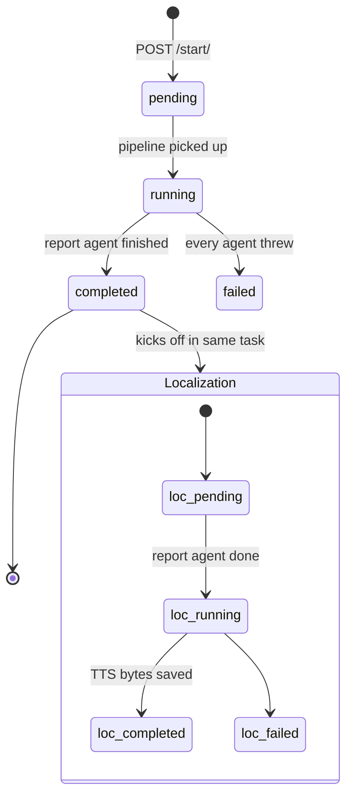

# Architecture

If you've got 90 seconds, this is the picture.

```
                   ┌─────────────────────────────────────────────┐
                   │                  Browser                    │
                   │   React 18 · Vite · Tailwind · Framer       │
                   └──────────────┬──────────────────────────────┘
                                  │  axios · JWT
                                  ▼
                   ┌─────────────────────────────────────────────┐
                   │             Django 6 · DRF                  │
                   │   APIs · auth · session orchestration       │
                   └──┬─────────────────────────────────────┬────┘
                      │                                     │
                      │ run_analysis_session()              │ /report/audio
                      ▼                                     ▼
            ┌──────────────────┐                  ┌────────────────────┐
            │  Agent pipeline  │                  │  Localizer         │
            │  (5 LLM calls)   │                  │  translate + TTS   │
            └────────┬─────────┘                  └─────────┬──────────┘
                     │                                      │
       ┌─────────────┴──────────────┐         ┌─────────────┴─────────────┐
       ▼              ▼             ▼         ▼              ▼            ▼
   Ollama        Gemini         Mock      HF model      TTS HTTP     Matcha-TTS
  (local)        (cloud)      (canned)    (en↔ks)       (you host)   (in-process)
```

We picked the boring parts (Django, SQLite, JWT) on purpose so the
weird parts (a Kashmiri voice synthesised in 150 diffusion steps while
the report is still loading) had room to be weird.

---

## The pipeline, drawn properly

```mermaid
sequenceDiagram
    autonumber
    participant U as User
    participant API as Django API
    participant DB as DB
    participant LLM as LLM (Ollama / Gemini)
    participant T as HF translator
    participant TTS as TTS server

    U->>API: POST /api/analysis/start/
    API->>DB: create AnalysisSession (running)
    API-->>U: 201 (id)

    rect rgb(20,20,30)
    note over API,LLM: synchronous chain — 5 calls, in order
    API->>LLM: CompetitorAgent prompt
    LLM-->>API: JSON (5 competitors)
    API->>DB: write Competitor rows

    API->>LLM: TrendAgent
    LLM-->>API: JSON
    API->>DB: write Trend rows

    API->>LLM: IdeationAgent (uses competitors + trends)
    LLM-->>API: 10 ideas
    API->>DB: write Idea rows

    API->>LLM: ValidationAgent (per idea)
    LLM-->>API: scores + verdict
    API->>DB: write IdeaValidation

    API->>LLM: ReportAgent (everything as context)
    LLM-->>API: summary + insights + actions
    API->>DB: write Report
    end

    API->>DB: session.status = completed
    note over U,API: UI flips here.<br/>English report renders.

    rect rgb(15,30,30)
    note over API,TTS: still in the same request — localiser fires
    API->>T: translate summary + insights + actions → ks
    T-->>API: Kashmiri text
    API->>DB: report.ks_translation
    API->>TTS: synthesise(summary_ks, n_timesteps=150)
    TTS-->>API: audio/wav bytes
    API->>DB: report.ks_audio + status=completed
    end

    U->>API: GET /api/analysis/{id}/report/
    API->>DB: read Report (with cached ks_*)
    API-->>U: JSON + ks_audio_available=true
    U->>API: POST /report/audio/ (lang=ks)
    API->>DB: read ks_audio
    API-->>U: audio/wav blob
```



The trick: the session flips to **completed** *before* the localiser
runs, so the panel sees the English report immediately. The audio
arrives moments later. By the time someone reads the executive summary,
the play button is already wired up.

---

## State machine



`session.status` and `report.localization_status` are independent on
purpose — the UI can show "report ready, narration cooking" without
either side blocking the other.

---

## Why these layers

| Layer | What we picked | Why |
|---|---|---|
| Backend | Django 6 + DRF | Boring, batteries included. We didn't want to argue about routing or auth. |
| DB | SQLite (default) | One file. Migrations are fast. Postgres ready via `DATABASE_URL` for prod. |
| Async | Django Q + ORM broker | No Redis. The dev path runs sync; the prod path queues. Same code. |
| LLM | Ollama / Gemini / Mock | Local model for the demo (offline-safe), cloud for speed when wifi works, mock so the frontend dev never needed a key. |
| Translation | HF · LLM · HTTP | Three providers. Local Hugging Face for accuracy on Kashmiri, LLM for fallback, HTTP for "use whatever you've already got." |
| TTS | `local_http` · `local_matcha` | Either point at a Modal/FastAPI server, or load Bolbosh in-process. Both speak the same `BaseTTS` interface. |
| Frontend | React + Vite + Tailwind v4 + Framer Motion | Fast dev loop. Tailwind v4 means no config. Framer Motion handles the Apple-style scroll reveals. |

---

## Memory dance

There's a wrinkle when you run Ollama and a Hugging Face translator on
the same machine. Both want all the GPU. Both will OOM if loaded at
the same time.

`services/memory.py` handles the swap. Before each translation we
`unload_llm()` (POSTs `keep_alive=0` to Ollama, which releases the
weights). Before each LLM call after a translation, we
`unload_translator()` (drops the HF model from `torch.cuda`). It looks
silly when written down, but it's the difference between the demo
booting on a laptop and the demo OOM-killing the kernel.

---

## What we did not build

- A users CRUD UI (auth is `AllowAny` in dev, dev requests fall back to a `demo` user)
- Multi-tenant rate-limiting
- A real billing / quota story
- Background worker autoscaling

If you're curious about any of those, the comment at the top of
`config/settings/production.py` is honest about what you'd need to flip.
